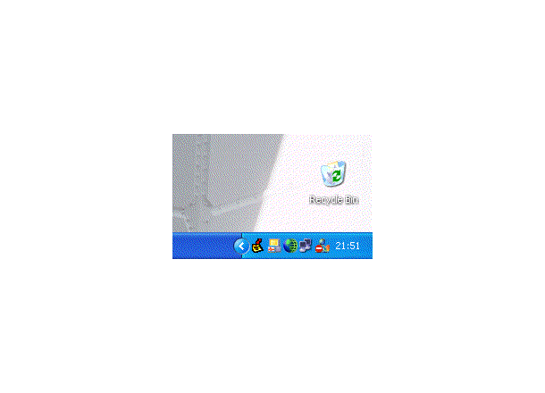



## BartNet Startup Manager

### Description

This program runs in the background and tells the user when a new program has added itself to the registry to startup with Windows. The purpose of this program is to make sure that no programs startup with Windows that the user doesn't know about. You could just use Regedit to see which programs they are but not a lot of people feel comfortable about using it, don't know where to look or don't even know it exists. This programs works fine on my pc but if you find any errors than please let me know a.s.a.p. (error@bartnet.be).
 
### More Info
 

             |
---                |---
**Submitted On**   |2004-01-10 15:58:36
**By**             |[BelgiumBoy\_007](https://github.com/Planet-Source-Code/PSCIndex/blob/master/ByAuthor/belgiumboy-007.md)
**Level**          |Advanced
**User Rating**    |4.8 (38 globes from 8 users)
**Compatibility**  |VB 6\.0
**Category**       |[Complete Applications](https://github.com/Planet-Source-Code/PSCIndex/blob/master/ByCategory/complete-applications__1-27.md)
**World**          |[Visual Basic](https://github.com/Planet-Source-Code/PSCIndex/blob/master/ByWorld/visual-basic.md)
**Archive File**   |[BartNet\_St1695481172004\.zip](https://github.com/Planet-Source-Code/belgiumboy-007-bartnet-startup-manager__1-51052/archive/master.zip)

